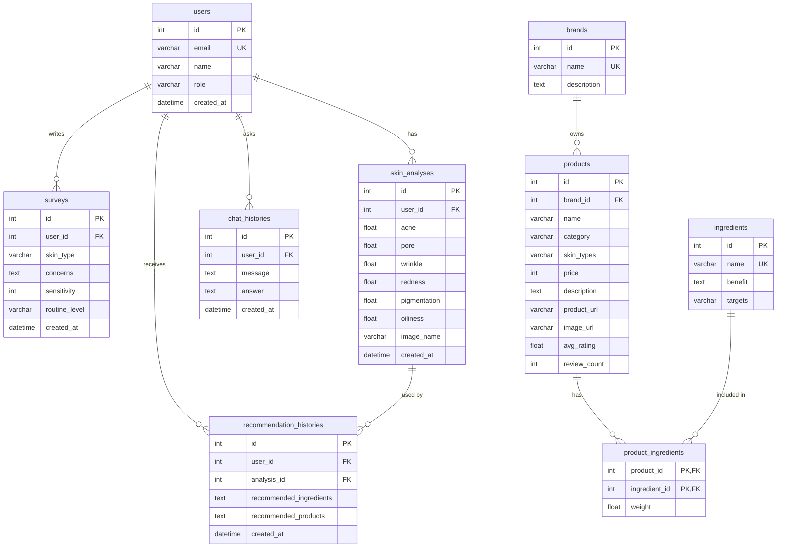
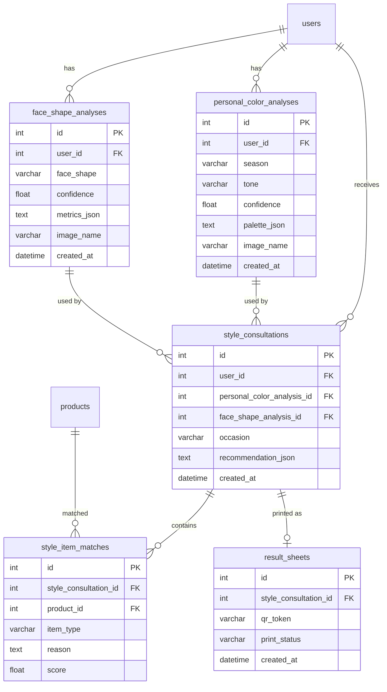

# BeautyAI ERD

## 1. 개요

이 문서는 BeautyAI의 현재 구현 데이터 모델과 향후 StyleAI 확장 후보 데이터 모델을 구분해 정의한다.

현재 구현된 핵심 도메인은 다음이다.

- 사용자
- 설문
- 얼굴 피부 분석
- 브랜드
- 성분
- 상품
- 상품-성분 매핑
- 추천 이력
- 상담 이력

## 2. 현재 구현 ERD



## 3. 테이블 상세

### 3.1 `users`

사용자 기본 정보를 저장한다.

| 컬럼 | 타입 | 설명 |
|---|---|---|
| `id` | int | PK |
| `email` | varchar | 이메일, unique |
| `name` | varchar | 사용자명 |
| `role` | varchar | `customer`, `admin` 등 |
| `created_at` | datetime | 생성일 |

### 3.2 `surveys`

추천 요청 시 사용자의 설문 정보를 저장한다.

현재 저장 컬럼은 핵심 추천 필드 중심이다. 프론트엔드 DTO에는 `gender`, `age_group`, `makeup_concerns`, `area_concerns`, `male_extras`가 있으나 현재 DB 테이블에는 별도 컬럼으로 분리되어 있지 않다. 향후 분석 통계를 강화하려면 설문 테이블 확장이 필요하다.

### 3.3 `skin_analyses`

얼굴 피부 분석 결과를 저장한다.

| 분석 항목 | 설명 |
|---|---|
| `acne` | 여드름 관련 점수 |
| `pore` | 모공 관련 점수 |
| `wrinkle` | 주름 관련 점수 |
| `redness` | 홍조 관련 점수 |
| `pigmentation` | 색소침착 관련 점수 |
| `oiliness` | 유분 관련 점수 |

바디 피부 분석 결과는 현재 별도 테이블에 저장하지 않는다.

### 3.4 `brands`

상품 브랜드 정보를 저장한다.

### 3.5 `ingredients`

성분 정보를 저장한다. `targets`는 쉼표로 구분된 피부 고민/분석 타깃 문자열이다.

예:

```text
redness,pigmentation
```

### 3.6 `products`

추천 대상 상품 정보를 저장한다.

외부 쇼핑몰과 연결하기 위해 `product_url`, `image_url`, `avg_rating`, `review_count`를 포함한다.

### 3.7 `product_ingredients`

상품과 성분의 다대다 매핑 테이블이다.

### 3.8 `recommendation_histories`

추천 결과를 저장한다.

- `recommended_ingredients`: JSON 문자열
- `recommended_products`: JSON 문자열

### 3.9 `chat_histories`

사용자 질문과 AI 답변을 저장한다.

## 4. 현재 모델의 설계 메모

| 항목 | 현재 상태 | 향후 개선 후보 |
|---|---|---|
| 설문 | 일부 필드만 DB 저장 | `gender`, `age_group`, 고민 목록 세분화 |
| 바디 분석 | 응답만 반환, DB 미저장 | `body_skin_analyses` 추가 |
| 추천 이력 | 성분/상품을 JSON 문자열로 저장 | 추천 이력 상세 테이블 분리 |
| 성분 타깃 | 쉼표 문자열 | `ingredient_targets` 정규화 |
| 상품 플랫폼 | URL 기반 추론 | `product_platform_links` 분리 |

## 5. 향후 확장 ERD 후보

퍼스널컬러, 얼굴형, 스타일 컨설팅, 결과지 기능을 구현할 경우 다음 테이블을 추가한다.



## 6. 확장 테이블 설명

| 테이블 | 설명 |
|---|---|
| `personal_color_analyses` | 퍼스널컬러 분석 결과 |
| `face_shape_analyses` | 얼굴형 분석 결과 |
| `style_consultations` | AI 스타일 컨설팅 결과 |
| `style_item_matches` | 컨설팅 결과와 상품 매칭 |
| `result_sheets` | QR/프린트 결과지 |

