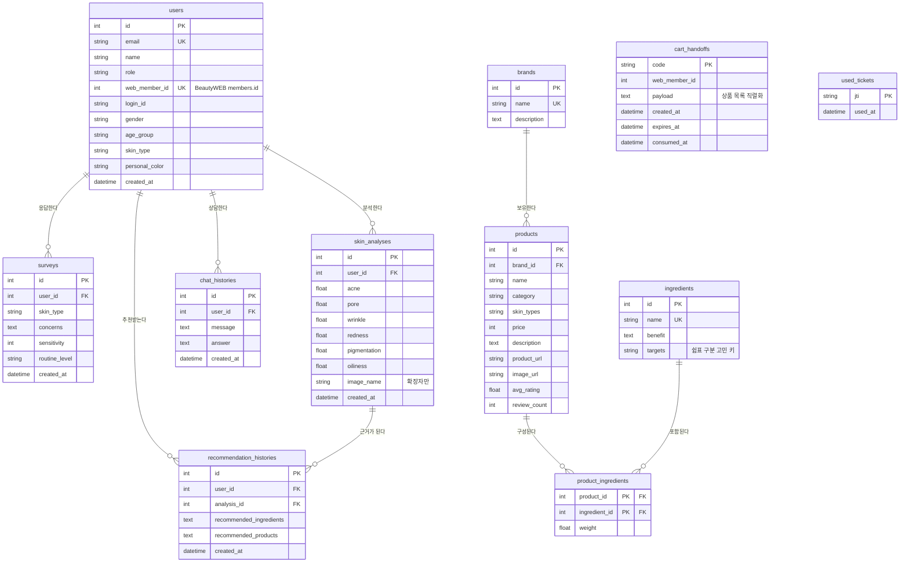

# BeautyAI ERD

## 1. 개요

- DBMS: PostgreSQL(개발·운영), SQLite(로컬 단독 실행)
- 매핑: SQLAlchemy 2.0 (`Mapped` / `mapped_column`), 마이그레이션은 Alembic
- 작성 기준: 2026-08-10, `backend/app/models/domain.py` 실제 정의
- 테이블 11개. 이전 판(2026-06-29, 9개)에서 `cart_handoffs`, `used_tickets` 가 추가되고 `users` 가 확장되었다.

## 2. ERD

## 3. 테이블 상세

### 3.1 `users`

사용자. 익명 이용이 가능하므로 대부분의 컬럼이 NULL 가능하다.

- `web_member_id` — BeautyWEB `members.id`. 핸드오프 티켓으로 들어온 계정을 여기에 붙여 **같은 사람의 분석·추천 이력이 이어지게** 한다. 웹을 거치지 않은 사용자는 NULL. 유니크 인덱스.
- `gender` / `age_group` / `skin_type` / `personal_color` — 웹 마이페이지에서 받아온 프로필. 설문 프리필과 "저장된 퍼스널컬러 바로쓰기"에 쓴다.

### 3.2 `cart_handoffs`

결과지 QR → 웹 장바구니 담기용 **1회용 코드**.

QR 에 상품 목록을 통째로 싣지 않는 이유는 인식률이다. 상품 5개(이름·브랜드·구매 URL)를 base64 로 실으면 1KB 를 넘겨 QR 이 조밀해지고, 인쇄물에서 인식에 실패한다. 그래서 QR 에는 짧은 코드만 싣고(`<WEB>/cart?ai=<code>`) 실제 목록은 서버끼리 주고받는다.

`web_member_id` 를 함께 들고 있어 **폰이 로그인되어 있지 않아도** 본인 계정 장바구니에 담긴다. 대신 코드 자체가 자격증명이므로 `expires_at`(짧은 수명)과 `consumed_at`(1회용)으로 태운다.

### 3.3 `used_tickets`

소각한 핸드오프 티켓의 `jti`.

티켓은 URL 프래그먼트로 오므로 브라우저 히스토리에 남는다. 수명이 120초로 짧지만 그 안의 재사용까지 막으려고 1회용으로 태운다. Redis 대신 DB 유니크 제약을 쓰는데, 교환은 사용자당 세션에 한 번뿐이라 비용이 문제되지 않기 때문이다.

### 3.4 `surveys`

설문. `concerns` 는 쉼표 구분 문자열이다.

### 3.5 `skin_analyses`

얼굴 피부 분석 결과 6항목(0~100).

`image_name` 에는 **확장자만** 담는다. 업로드 파일명에는 이름·날짜·기기·장소가 들어가기 쉬운데 이 컬럼은 어디서도 읽지 않으면서 `user_id` 와 묶여 남아 있었다.

⚠ 6항목은 완전히 독립되지 않는다(학습 라벨 자체가 일부 겹친다). 화면은 3그룹·3구간으로 보여준다.

### 3.6 `brands` / `products`

카탈로그. `products.skin_types` 는 쉼표 구분(`all` 포함), `category` 는 루틴 슬롯 판정에 쓴다.

`price` 컬럼은 있으나 **화면에는 표시하지 않는다.** 카드 하나에 판매처가 여럿이라 어느 값을 써도 최소 한 곳과는 맞지 않는다.

### 3.7 `ingredients` / `product_ingredients`

성분과 상품–성분 연결(복합 기본키 + `weight`).

`ingredients.targets` 는 쉼표 구분 고민 키(`acne`, `pore`, `wrinkle`, `redness`, `pigmentation`, `oiliness`, `dryness`)이며, 성분 추론의 교집합 대상이다.

⚠ 랭킹 루프에서 이 관계를 `selectinload` 하면 요청당 수 초가 늘어난다. 캐시된 성분 인덱스를 쓴다.

### 3.8 `recommendation_histories`

추천 이력. 성분·상품 목록을 JSON 문자열로 남긴다. `analysis_id` 로 근거가 된 분석과 연결된다.

### 3.9 `chat_histories`

상담 질문·답변. 카탈로그 답변·LLM 답변·폴백 답변 모두 여기 남는다.

## 4. 설계 메모

- **익명 우선.** 로그인 없이 전 기능을 쓸 수 있어야 하므로 `user_id` 는 대부분 NULL 가능하다.
- **웹과의 연결은 `web_member_id` 하나로 잇는다.** 계정 체계를 복제하지 않는다.
- **자격증명성 레코드는 반드시 만료·소각을 갖는다**(`cart_handoffs`, `used_tickets`).
- **삭제 가능성이 요구사항이다.** `DELETE /api/me/data` 가 사용자 관련 행을 지운다.
- **카탈로그는 외부에서 들어온다.** 수집·검증은 서비스 계층에서 하고, 테이블은 결과만 들고 있다.

## 5. 확장 후보

| 후보 | 이유 |
|---|---|
| `personal_color_results` | 지금은 퍼스널컬러 판정 결과가 저장되지 않는다. 재방문 시 재분석이 필요하다 |
| `nail_analyses` | 네일 검출·색 이력이 남지 않는다 |
| `products.region`, `products.currency` | 지역·통화가 컬럼에 없어 서비스 계층 추론에 의존한다 |
| `product_links`(플랫폼별 URL·검증 상태) | 지금은 링크가 단일 컬럼이라 플랫폼별 상태를 남길 수 없다 |
| `analysis_images`(동의 기반) | 재현·재학습용 이미지 보관이 필요할 때. 개인정보 정책 선행 필요 |
