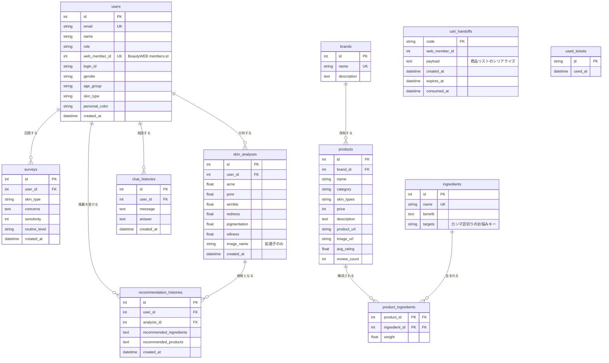

# BeautyAI ERD（日本語版）

> 韓国語版: [AI_ERD.md](./AI_ERD.md)

## 1. 概要

- DBMS: PostgreSQL（開発・本番）、SQLite（ローカル単独実行）
- マッピング: SQLAlchemy 2.0（`Mapped` / `mapped_column`）、マイグレーションは Alembic
- 作成基準: 2026-08-10、`backend/app/models/domain.py` の実定義
- テーブル11件。前版（2026-06-29、9件）から `cart_handoffs`, `used_tickets` が追加され、`users` が拡張された。

## 2. ERD

## 3. テーブル詳細

### 3.1 `users`

利用者。匿名での利用が可能なため、ほとんどのカラムが NULL 可である。

- `web_member_id` — BeautyWEB の `members.id`。ハンドオフチケットで入ってきたアカウントをここに紐づけ、**同じ人の分析・推薦履歴がつながる**ようにする。Webを経由していない利用者は NULL。ユニークインデックス。
- `gender` / `age_group` / `skin_type` / `personal_color` — Webのマイページから受け取ったプロフィール。アンケートの事前入力と「保存済みパーソナルカラーの即利用」に使う。

### 3.2 `cart_handoffs`

結果シートQR → Webカート追加のための**使い捨てコード**。

QRに商品リストを丸ごと載せない理由は認識率である。商品5件（名前・ブランド・購入URL）を base64 で載せると1KBを超えてQRが密になり、印刷物での認識に失敗する。そのためQRには短いコードのみを載せ（`<WEB>/cart?ai=<code>`）、実際のリストはサーバー間でやり取りする。

`web_member_id` を併せて保持しているため、**スマホがログインしていなくても**本人アカウントのカートに入る。ただしコード自体が資格情報であるため、`expires_at`（短い寿命）と `consumed_at`（使い捨て）で消し込む。

### 3.3 `used_tickets`

消し込んだハンドオフチケットの `jti`。

チケットはURLフラグメントで届くため、ブラウザ履歴に残る。寿命は120秒と短いが、その間の再利用まで防ぐために使い捨てにする。Redis ではなくDBのユニーク制約を使うのは、交換が利用者あたりセッションに一度だけであり、コストが問題にならないためである。

### 3.4 `surveys`

アンケート。`concerns` はカンマ区切りの文字列である。

### 3.5 `skin_analyses`

顔の肌分析結果6項目（0〜100）。

`image_name` には**拡張子のみ**を入れる。アップロードのファイル名には氏名・日付・端末・場所が入りやすいが、このカラムはどこからも読まれないまま `user_id` と紐づいて残っていた。

⚠ 6項目は完全には独立しない（学習ラベル自体が一部重なる）。画面は3グループ・3区分で見せる。

### 3.6 `brands` / `products`

カタログ。`products.skin_types` はカンマ区切り（`all` を含む）、`category` はルーティンスロットの判定に使う。

`price` カラムは存在するが、**画面には表示しない。** 1枚のカードに販売先が複数あり、どの値を使っても少なくとも1か所とは一致しない。

### 3.7 `ingredients` / `product_ingredients`

成分と、商品–成分の関連（複合主キー + `weight`）。

`ingredients.targets` はカンマ区切りのお悩みキー（`acne`, `pore`, `wrinkle`, `redness`, `pigmentation`, `oiliness`, `dryness`）であり、成分推論の積集合の対象となる。

⚠ ランキングのループでこの関連を `selectinload` すると、リクエストあたり数秒増える。キャッシュされた成分インデックスを使う。

### 3.8 `recommendation_histories`

推薦履歴。成分・商品のリストをJSON文字列で残す。`analysis_id` で根拠となった分析と結びつく。

### 3.9 `chat_histories`

相談の質問と回答。カタログ回答・LLM回答・フォールバック回答のいずれもここに残る。

## 4. 設計メモ

- **匿名を優先する。** ログインなしで全機能を使えるべきなので、`user_id` はほとんど NULL 可である。
- **Webとの接続は `web_member_id` ひとつでつなぐ。** アカウント体系を複製しない。
- **資格情報にあたるレコードは必ず期限・消し込みを持つ**（`cart_handoffs`, `used_tickets`）。
- **削除可能であることが要件である。** `DELETE /api/me/data` が利用者関連の行を削除する。
- **カタログは外部から入る。** 収集・検証はサービス層で行い、テーブルは結果だけを持つ。

## 5. 拡張候補

| 候補 | 理由 |
|---|---|
| `personal_color_results` | 現在はパーソナルカラーの判定結果が保存されない。再訪時に再分析が必要になる |
| `nail_analyses` | ネイル検出・色の履歴が残らない |
| `products.region`, `products.currency` | 地域・通貨がカラムに無く、サービス層の推論に依存している |
| `product_links`（プラットフォーム別URL・検証状態） | 現在はリンクが単一カラムのため、プラットフォーム別の状態を残せない |
| `analysis_images`（同意ベース） | 再現・再学習用に画像を保管する場合。個人情報方針の整備が先 |
