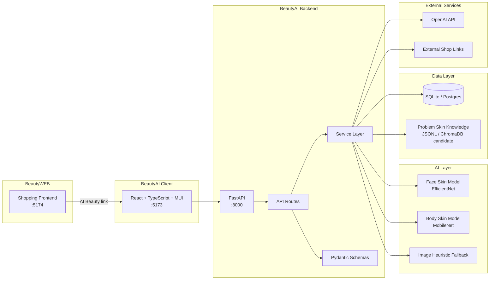
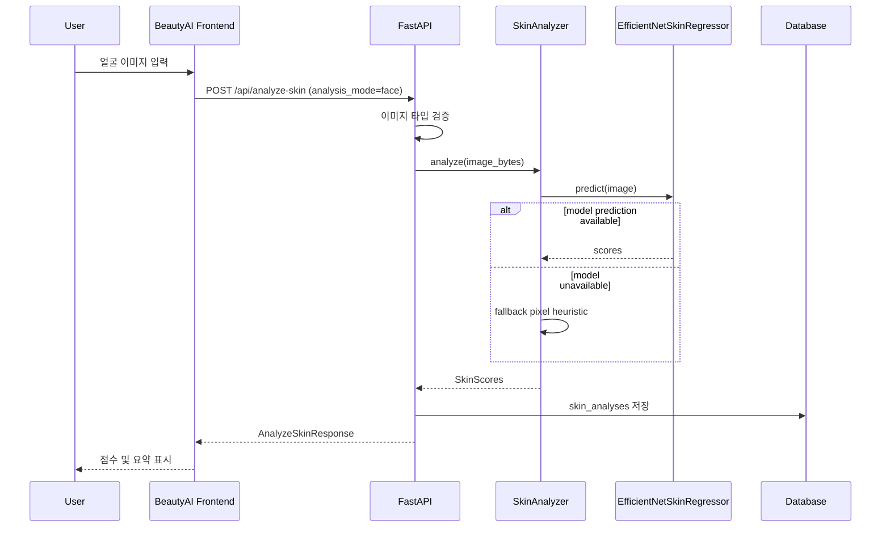
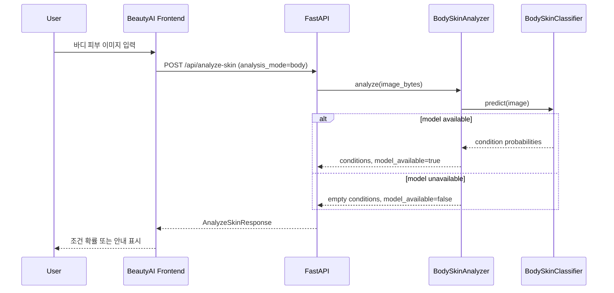
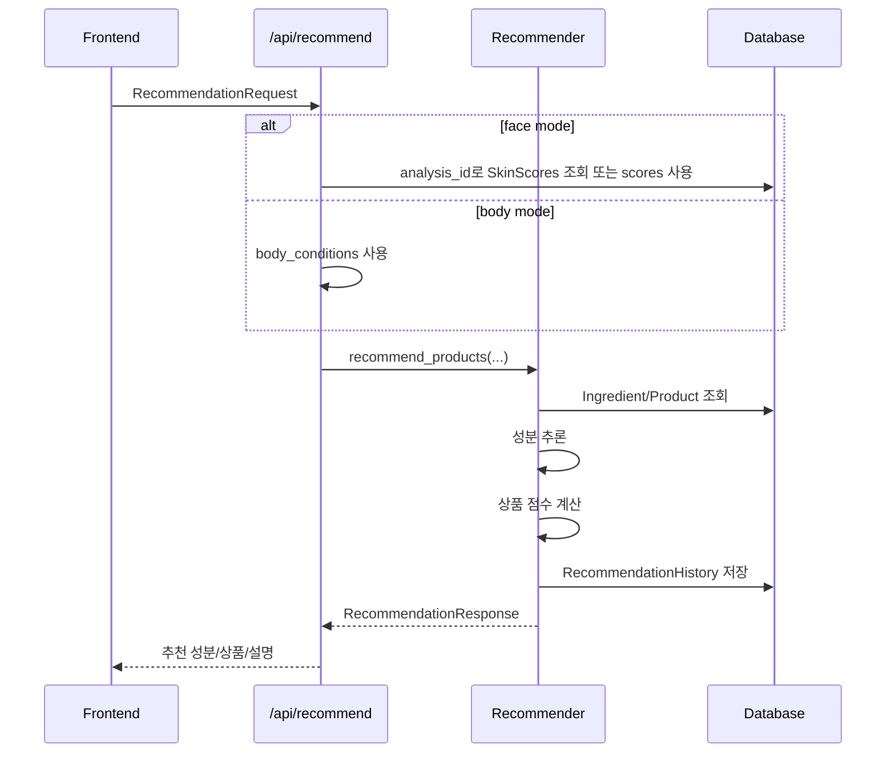
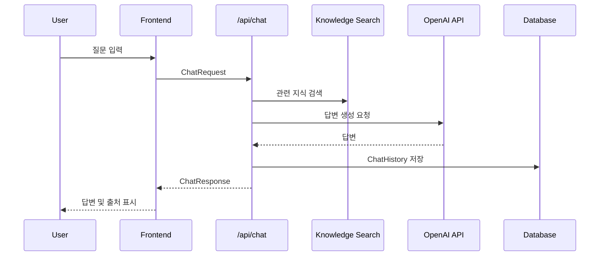
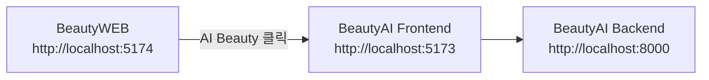
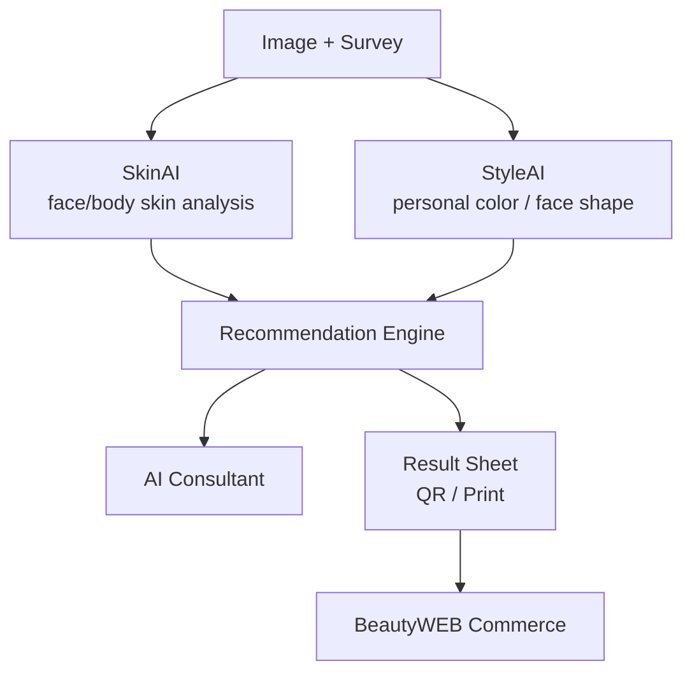

# BeautyAI System Design Overview

## 1. 시스템 목적

BeautyAI는 이미지 기반 분석과 설문 기반 추천을 결합해 사용자에게 맞춤형 뷰티 추천과 AI 상담을 제공하는 시스템이다. BeautyWEB 쇼핑몰은 사용자의 유입과 상품 탐색을 담당하고, BeautyAI는 AI 분석과 추천을 담당한다.

## 2. 현재 시스템 아키텍처

## 3. 주요 런타임 포트

| 시스템 | 포트 | 실행 예 |
|---|---:|---|
| BeautyAI Backend | 8000 | `uvicorn app.main:app --reload --port 8000` |
| BeautyAI Frontend | 5173 | `npm run dev` |
| BeautyWEB Frontend | 5174 | `npm run dev` |

## 4. 핵심 처리 흐름

### 4.1 얼굴 피부 분석 흐름

### 4.2 바디 피부 분석 흐름

### 4.3 추천 흐름

### 4.4 AI 상담 흐름

## 5. 모듈 책임

| 계층 | 모듈 | 책임 |
|---|---|---|
| API | `routes.py` | 요청 검증, 서비스 호출, 응답 조립 |
| Schema | `api.py` | 요청/응답 타입 정의 |
| Model | `domain.py` | DB 테이블 정의 |
| Service | `skin_analyzer.py` | 얼굴 피부 분석 |
| Service | `body_skin_analyzer.py` | 바디 피부 분석 |
| Service | `recommender.py` | 성분 추론, 상품 점수 계산, 이력 저장 |
| Service | `chatbot.py` | AI 상담 |
| AI | `skin_model.py` | 얼굴 피부 모델 로딩/추론 |
| AI | `body_skin_model.py` | 바디 피부 모델 로딩/추론 |
| Core | `config.py` | 환경설정 |
| Core | `database.py` | DB 연결 |

## 6. BeautyWEB 연동 설계

현재 BeautyWEB은 AI 기능을 직접 호출하지 않고 BeautyAI 프론트엔드로 이동한다.

향후 연동 후보:

- BeautyWEB 로그인 사용자 ID를 BeautyAI에 전달
- BeautyAI 추천 결과의 상품 ID를 BeautyWEB 상품 상세로 연결
- AI 분석 세션 ID를 QR 또는 결과지로 공유
- BeautyWEB 상품 DB와 BeautyAI 추천 DB 통합

## 7. 데이터 저장 정책

| 데이터 | 현재 처리 | 향후 후보 |
|---|---|---|
| 얼굴 분석 | DB 저장 | 이미지 저장 정책 추가 |
| 바디 분석 | 응답만 반환 | 별도 분석 테이블 추가 |
| 추천 이력 | JSON 문자열 저장 | 추천 상세 테이블 분리 |
| 상담 이력 | DB 저장 | 사용자별 상담 컨텍스트 확장 |
| 상품 링크 | URL/브랜드 기반 생성 | 플랫폼별 링크 테이블 분리 |

## 8. 확장 아키텍처

## 9. 품질 기준

- API 요청/응답 DTO가 프론트엔드 타입과 일치해야 한다.
- 모델 파일이 없어도 서버는 안내 응답을 반환해야 한다.
- 추천 API는 추천 이력을 저장해야 한다.
- 프론트엔드는 분석 전/분석 중/분석 완료/추천 완료 상태를 구분해야 한다.
- BeautyWEB에서 BeautyAI로 이동하는 링크는 환경별로 바꿀 수 있어야 한다.

