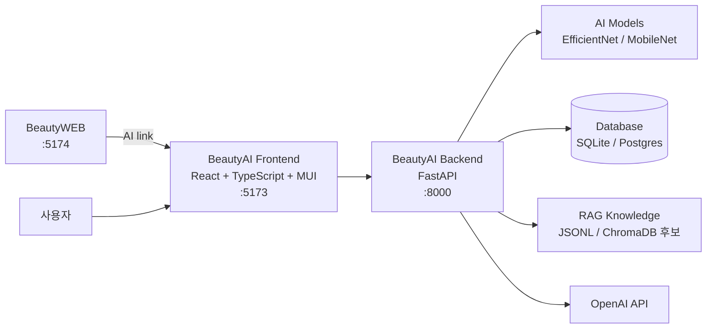
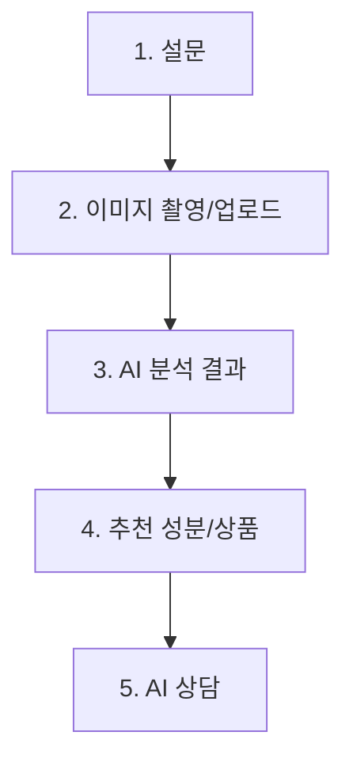
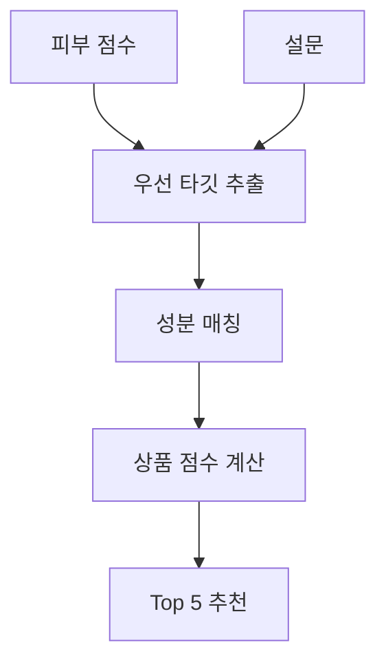

# BeautyAI 기본설계서

## 1. 시스템 개요

BeautyAI는 이미지 기반 AI 분석과 설문 기반 추천을 결합한 뷰티 추천 시스템이다. 사용자는 얼굴 또는 바디 이미지를 업로드하고, 피부/뷰티 관련 설문을 작성한 뒤 분석 결과와 추천 상품을 확인한다. 이후 AI 상담을 통해 루틴, 성분, 추천 결과에 대한 추가 질문을 할 수 있다.

## 2. 개발 목표

- 얼굴 피부 상태 점수화
- 바디 피부 상태 분류
- 사용자 설문 기반 성분 추론
- 상품 추천 및 추천 근거 제공
- AI 피부 상담 제공
- 추천 이력 저장
- BeautyWEB 쇼핑몰에서 AI 페이지로 이동 가능한 구조 제공
- 향후 퍼스널컬러, 얼굴형, 스타일 컨설팅으로 확장 가능한 모듈 구조 확보

## 3. 시스템 구성

## 4. 기술 스택

| 영역 | 기술 |
|---|---|
| Frontend | React, TypeScript, Material UI, Vite |
| Backend | FastAPI, Pydantic, SQLAlchemy |
| Database | SQLite 개발, Postgres/Supabase 운영 후보 |
| Migration | Alembic |
| AI | PyTorch, EfficientNet, MobileNet 계열 |
| Image Processing | Pillow, OpenCV 후보 |
| LLM/RAG | OpenAI API, JSONL 지식 데이터, ChromaDB 후보 |
| Infra 후보 | Docker, Redis, AWS 또는 Supabase |

## 5. 주요 화면 흐름

### 5.1 설문 화면

- 성별
- 연령대
- 피부 타입
- 피부 고민
- 메이크업 고민
- 부위 고민
- 남성 추가 고민
- 민감도
- 루틴 수준

### 5.2 이미지 입력 화면

- 분석 모드 선택
  - 얼굴 피부 분석
  - 바디 피부 분석
- 카메라 촬영
- 이미지 업로드
- 얼굴 분석은 3~5장 입력을 기본 UX로 사용
- 바디 분석은 1~5장 입력을 기본 UX로 사용

### 5.3 분석 결과 화면

- 얼굴 분석: 6개 피부 점수 표시
- 바디 분석: 상위 조건 확률 표시
- 분석 요약 문구 표시

### 5.4 추천 화면

- 추천 성분
- 추천 상품 Top 5
- 상품별 브랜드, 카테고리, 가격, 평점, 리뷰 수, 외부 플랫폼 링크
- 추천 설명
- 추천 이력 일부 표시

### 5.5 상담 화면

- 사용자의 질문 입력
- AI 답변 표시
- 참조 출처 표시

## 6. 백엔드 모듈 구조

| 모듈 | 책임 |
|---|---|
| `api.routes` | API 엔드포인트 |
| `schemas.api` | 요청/응답 DTO |
| `models.domain` | SQLAlchemy 도메인 모델 |
| `services.skin_analyzer` | 얼굴 피부 분석 |
| `services.body_skin_analyzer` | 바디 피부 분석 |
| `services.recommender` | 성분 추론 및 상품 추천 |
| `services.chatbot` | AI 상담 |
| `services.problem_skin_knowledge` | 문제성 피부 지식 데이터 처리 |
| `core.config` | 환경변수 및 경로 설정 |
| `core.database` | DB 세션 및 Base 설정 |

## 7. 주요 API

| Method | Path | 설명 |
|---|---|---|
| GET | `/health` | 서버 상태 확인 |
| POST | `/api/analyze-skin` | 얼굴/바디 이미지 분석 |
| POST | `/api/recommend` | 분석 결과와 설문 기반 추천 |
| POST | `/api/chat` | AI 피부 상담 |
| GET | `/api/products` | 상품 목록 조회 |
| GET | `/api/history` | 추천 이력 조회 |
| GET | `/api/admin/statistics` | 관리자 통계 |

## 8. 데이터 모델 개요

| 테이블 | 설명 |
|---|---|
| `users` | 사용자 |
| `surveys` | 설문 |
| `skin_analyses` | 얼굴 피부 분석 결과 |
| `brands` | 브랜드 |
| `ingredients` | 성분 |
| `products` | 상품 |
| `product_ingredients` | 상품-성분 매핑 |
| `recommendation_histories` | 추천 이력 |
| `chat_histories` | 상담 이력 |

## 9. 추천 로직 개요

### 9.1 얼굴 추천

### 9.2 바디 추천

- 보습/장벽 중심 성분 우선
- 강한 활성 성분 제외
- 바디 케어 카테고리 우선
- 플랫폼 적합도와 평점 반영

## 10. 외부 플랫폼 링크

추천 상품은 다음 플랫폼 검색 또는 직접 링크를 제공할 수 있다.

- Amazon US
- Amazon JP
- Yahoo Japan
- Naver Shopping
- Matsukiyo
- Olive Young Global

## 11. 향후 확장 구조

현재 AI 프로젝트는 `SkinAI` 중심이다. 향후 확장 시 아래 모듈을 추가한다.

| 확장 모듈 | 설명 |
|---|---|
| `PersonalColorAnalyzer` | 퍼스널컬러 분석 |
| `FaceShapeAnalyzer` | 얼굴형 분석 |
| `StyleConsultant` | 상황별 스타일 컨설팅 |
| `ItemMatcher` | 색조/헤어/주얼리/아이템 매칭 |
| `ResultSheetService` | 결과지, QR, 프린팅 |

## 12. 운영 고려사항

- 모델 파일 경로는 환경변수로 관리한다.
- 로컬 개발은 SQLite를 기본으로 한다.
- 운영 환경은 Postgres/Supabase를 고려한다.
- 분석 이미지의 저장 여부와 보존 기간은 별도 정책이 필요하다.
- 일본어 UI 전환을 고려해 프론트엔드 텍스트 리소스 분리가 필요하다.

