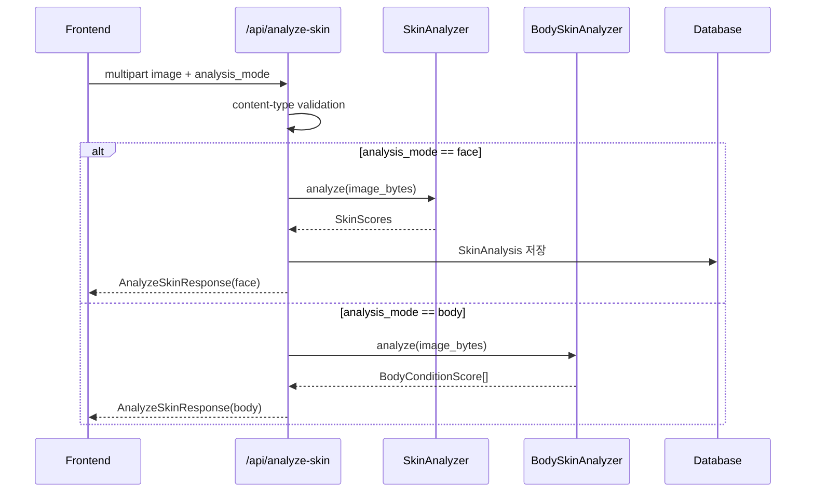
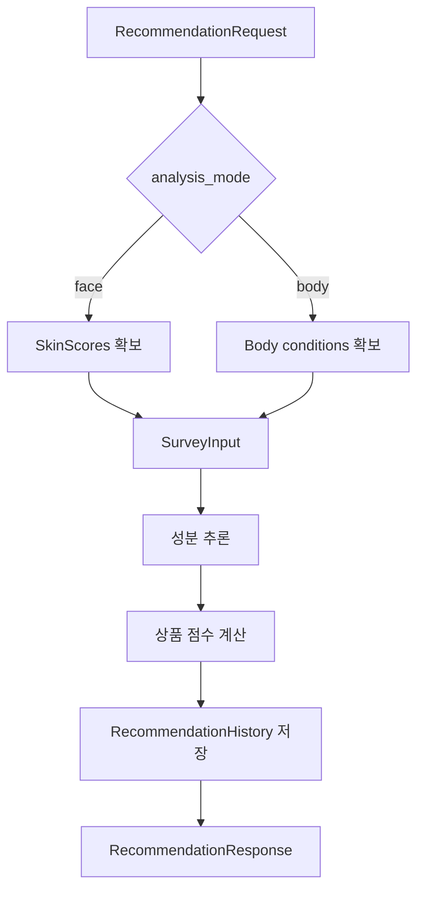

# BeautyAI 상세설계서

## 1. 문서 목적

이 문서는 BeautyAI의 API, DTO, 서비스 처리 흐름, 추천 로직, 데이터 저장 방식을 구현 가능한 수준으로 정의한다. 현재 구현된 얼굴/바디 피부 분석과 추천 기능을 기준으로 하며, 퍼스널컬러/얼굴형/스타일 컨설팅은 향후 확장 설계로 분리한다.

## 2. 프로젝트 구조

```text
backend/
└─ app/
   ├─ main.py
   ├─ api/
   │  └─ routes.py
   ├─ core/
   │  ├─ config.py
   │  └─ database.py
   ├─ models/
   │  └─ domain.py
   ├─ schemas/
   │  └─ api.py
   ├─ services/
   │  ├─ skin_analyzer.py
   │  ├─ body_skin_analyzer.py
   │  ├─ recommender.py
   │  ├─ chatbot.py
   │  └─ problem_skin_knowledge.py
   └─ ai/
      ├─ skin_model.py
      └─ body_skin_model.py

frontend/
└─ src/
   ├─ App.tsx
   ├─ api/client.ts
   ├─ types/api.ts
   └─ styles.css
```

## 3. 환경 설정

| 설정 | 기본값 | 설명 |
|---|---|---|
| `DATABASE_URL` | `sqlite:///./beautyai.db` | DB 연결 |
| `OPENAI_API_KEY` | 없음 | 상담 기능용 |
| `OPENAI_MODEL` | `gpt-4.1-mini` | 상담 생성 모델 |
| `CHROMA_PATH` | `./data/rag/chromadb` | 벡터 DB 후보 경로 |
| `REDIS_URL` | `redis://localhost:6379/0` | 캐시 후보 |
| `SKIN_MODEL_PATH` | `./data/models/skin_efficientnet_b0.pt` | 얼굴 피부 모델 |
| `BODY_SKIN_MODEL_PATH` | `./data/models/body_skin_mobilenet_v3.pt` | 바디 피부 모델 |
| `PROBLEM_SKIN_KNOWLEDGE_PATH` | `./data/rag/problem_skin_knowledge.jsonl` | 문제성 피부 지식 |

## 4. API 상세

### 4.1 상태 확인

| 항목 | 내용 |
|---|---|
| Method | `GET` |
| Path | `/health` |
| Response | `{ "status": "ok" }` |

### 4.2 피부 분석

| 항목 | 내용 |
|---|---|
| Method | `POST` |
| Path | `/api/analyze-skin` |
| Content-Type | `multipart/form-data` |
| Request | `image`, `analysis_mode`, `user_id?` |
| Response | `AnalyzeSkinResponse` |

#### Request Fields

| 필드 | 타입 | 필수 | 설명 |
|---|---|---:|---|
| `image` | file | Y | 이미지 파일 |
| `analysis_mode` | string | N | `face` 또는 `body`, 기본값 `face` |
| `user_id` | int | N | 사용자 ID |

#### Face Response

```json
{
  "analysis_id": 1,
  "analysis_mode": "face",
  "scores": {
    "acne": 60,
    "pore": 55,
    "wrinkle": 20,
    "redness": 45,
    "pigmentation": 30,
    "oiliness": 70
  },
  "body_conditions": [],
  "model_available": true,
  "summary": "..."
}
```

#### Body Response

```json
{
  "analysis_id": null,
  "analysis_mode": "body",
  "scores": null,
  "body_conditions": [
    {
      "condition": "atopic_dermatitis",
      "label": "Atopic dermatitis",
      "probability": 72.0
    }
  ],
  "model_available": true,
  "summary": "..."
}
```

#### 처리 흐름



### 4.3 추천

| 항목 | 내용 |
|---|---|
| Method | `POST` |
| Path | `/api/recommend` |
| Content-Type | `application/json` |
| Request | `RecommendationRequest` |
| Response | `RecommendationResponse` |

#### RecommendationRequest

| 필드 | 타입 | 필수 | 설명 |
|---|---|---:|---|
| `analysis_id` | int | N | 기존 얼굴 분석 ID |
| `scores` | SkinScores | N | 직접 전달한 얼굴 분석 점수 |
| `analysis_mode` | string | N | `face` 또는 `body` |
| `body_conditions` | BodyConditionScore[] | N | 바디 분석 결과 |
| `survey` | SurveyInput | Y | 설문 |
| `platform` | string | N | `all`, `amazon_us`, `amazon_jp`, `yahoo_japan`, `naver`, `matsukiyo`, `oliveyoung` |
| `user_id` | int | N | 사용자 ID |

#### RecommendationResponse

| 필드 | 타입 | 설명 |
|---|---|---|
| `history_id` | int | 추천 이력 ID |
| `ingredients` | IngredientOut[] | 추천 성분 |
| `products` | ProductOut[] | 추천 상품 |
| `explanation` | string | 추천 설명 |

#### 처리 흐름



### 4.4 상품 목록

| 항목 | 내용 |
|---|---|
| Method | `GET` |
| Path | `/api/products` |
| Response | `ProductOut[]` |

상품은 브랜드와 성분을 eager loading하여 반환한다.

### 4.5 추천 이력

| 항목 | 내용 |
|---|---|
| Method | `GET` |
| Path | `/api/history` |
| Query | `user_id?` |
| Response | `HistoryOut[]` |

- 최신순 20건을 반환한다.
- `user_id`가 있으면 해당 사용자로 필터링한다.

### 4.6 AI 상담

| 항목 | 내용 |
|---|---|
| Method | `POST` |
| Path | `/api/chat` |
| Request | `ChatRequest` |
| Response | `ChatResponse` |

#### ChatRequest

| 필드 | 타입 | 설명 |
|---|---|---|
| `message` | string | 사용자 질문 |
| `user_id` | int | 사용자 ID |
| `context` | dict | 분석/추천 문맥 |

#### ChatResponse

| 필드 | 타입 | 설명 |
|---|---|---|
| `answer` | string | 답변 |
| `sources` | string[] | 참조 출처 |

### 4.7 관리자 통계

| 항목 | 내용 |
|---|---|
| Method | `GET` |
| Path | `/api/admin/statistics` |
| Response | 통계 dict |

반환 항목:

- 사용자 수
- 분석 수
- 추천 수
- 평균 피부 점수

## 5. DTO 상세

### 5.1 SurveyInput

| 필드 | 타입 | 기본값 | 설명 |
|---|---|---|---|
| `gender` | string | `female` | 성별 |
| `age_group` | string | `20s` | 연령대 |
| `skin_type` | string | `combination` | 피부 타입 |
| `concerns` | string[] | `[]` | 피부 고민 |
| `makeup_concerns` | string[] | `[]` | 메이크업 고민 |
| `area_concerns` | string[] | `[]` | 부위 고민 |
| `male_extras` | string[] | `[]` | 남성 추가 고민 |
| `sensitivity` | int | `2` | 1~5 |
| `routine_level` | string | `basic` | 루틴 수준 |

### 5.2 SkinScores

| 필드 | 범위 | 설명 |
|---|---:|---|
| `acne` | 0~100 | 여드름 관련 점수 |
| `pore` | 0~100 | 모공 관련 점수 |
| `wrinkle` | 0~100 | 주름 관련 점수 |
| `redness` | 0~100 | 홍조 관련 점수 |
| `pigmentation` | 0~100 | 색소침착 관련 점수 |
| `oiliness` | 0~100 | 유분 관련 점수 |

### 5.3 BodyConditionScore

| 필드 | 타입 | 설명 |
|---|---|---|
| `condition` | string | 내부 조건 코드 |
| `label` | string | 표시 라벨 |
| `probability` | float | 확률값 |

## 6. 분석 서비스 상세

### 6.1 SkinAnalyzer

역할:

- 이미지 바이트를 RGB 이미지로 변환
- 224x224 리사이즈
- EfficientNet 기반 모델 예측 시도
- 모델 예측값이 없으면 NumPy 기반 fallback 점수 계산
- `SkinScores` 반환

Fallback 계산 요소:

- RGB 평균
- 밝기 평균 및 표준편차
- 붉은기 신호
- 채도
- 어두운 픽셀 비율
- 밝은 픽셀 비율

### 6.2 BodySkinAnalyzer

역할:

- 이미지 바이트를 RGB 이미지로 변환
- MobileNet 계열 바디 피부 모델 예측
- 상위 3개 조건을 `BodyConditionScore`로 반환
- 모델이 없으면 `model_available=false` 반환

## 7. 추천 서비스 상세

### 7.1 얼굴 추천 성분 추론

성분 우선순위는 다음 입력을 결합한다.

- 피부 점수 45 이상 항목
- 설문의 피부 고민
- 메이크업 고민
- 부위 고민
- 남성 추가 고민
- 연령대 우선 타깃
- 민감도
- 피부 타입

### 7.2 얼굴 상품 점수

상품 점수 구성:

- 추천 성분 타깃과 상품 성분 타깃 매칭
- 피부 타입 매칭
- 피부 점수 기반 고민 매칭
- 외부 플랫폼 적합도
- 평점 보정

### 7.3 바디 추천 상품 필터

포함 우선 성분:

- Ceramide
- Panthenol
- Hyaluronic Acid
- Centella Asiatica
- Green Tea

제외 성분:

- Retinol
- Salicylic Acid
- Glycolic Acid
- Lactic Acid
- Vitamin C

허용 카테고리:

- cream
- lotion
- moisturizer
- moisturizers
- balm

### 7.4 플랫폼 적합도

지원 플랫폼:

- `amazon_us`
- `amazon_jp`
- `yahoo_japan`
- `naver`
- `matsukiyo`
- `oliveyoung`
- `all`

직접 URL 또는 브랜드 지역성을 기준으로 매칭한다.

## 8. 프론트엔드 상세

### 8.1 상태

| 상태 | 설명 |
|---|---|
| `currentStep` | 현재 단계 |
| `analysisMode` | face/body |
| `survey` | 설문 입력 |
| `faceFiles` | 업로드/촬영 이미지 |
| `analysis` | 분석 결과 |
| `recommendation` | 추천 결과 |
| `selectedPlatform` | 추천 플랫폼 필터 |
| `message` | 상담 질문 |
| `answer` | 상담 답변 |
| `history` | 추천 이력 |

### 8.2 주요 클라이언트 함수

| 함수 | 설명 |
|---|---|
| `analyzeSkin` | `/api/analyze-skin` 호출 |
| `recommend` | `/api/recommend` 호출 |
| `chat` | `/api/chat` 호출 |
| `getHistory` | `/api/history` 호출 |

## 9. 테스트 설계

현재 테스트 관점:

- `/health` 응답
- 상품 seed 데이터 조회
- 점수 직접 전달 추천
- 바디 분석 모델 상태 응답
- 바디 추천에서 강한 활성 성분 제외
- 문제성 피부 지식 데이터 처리

향후 추가 테스트:

- `analysis_mode` 오류 처리
- 이미지가 아닌 파일 업로드 오류
- `analysis_id` 없는 추천 요청 오류
- 플랫폼 필터별 추천 결과
- 상담 fallback 응답

## 10. 향후 확장 상세

### 10.1 StyleAI 확장 API 후보

| Method | Path | 설명 |
|---|---|---|
| POST | `/api/analyze-personal-color` | 퍼스널컬러 분석 |
| POST | `/api/analyze-face-shape` | 얼굴형 분석 |
| POST | `/api/style-consult` | 스타일 컨설팅 |
| POST | `/api/match-items` | 색조/헤어/주얼리/아이템 매칭 |
| GET | `/api/result-sheet/{id}` | 결과지 조회 |

### 10.2 신규 테이블 후보

- `personal_color_analyses`
- `face_shape_analyses`
- `style_consultations`
- `style_item_matches`
- `result_sheets`

