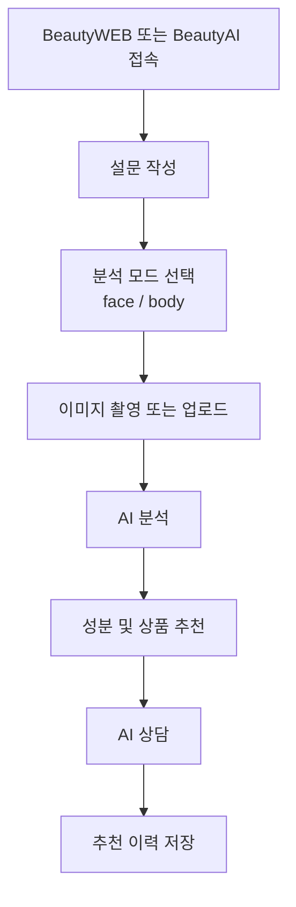

# BeautyAI 요건정의서

## 1. 문서 정보

| 항목 | 내용 |
|---|---|
| 시스템명 | BeautyAI |
| 대상 | AI 기반 피부/바디 분석 및 화장품 추천 서비스 |
| 목적 | 사용자의 이미지와 설문 정보를 기반으로 피부 상태 또는 바디 피부 상태를 분석하고, 적합한 성분과 상품을 추천하며, AI 상담을 제공한다. |
| 연동 시스템 | BeautyWEB 쇼핑몰 웹사이트 |
| 작성 기준 | 2026-06-29 현재 코드 및 프로젝트 문서 |

## 2. 프로젝트 목적

BeautyAI는 사용자가 직접 촬영하거나 업로드한 이미지를 기반으로 피부 관련 상태를 분석하고, 설문 결과를 결합하여 개인화된 화장품 추천 경험을 제공하는 AI 서비스이다.

현재 시스템의 중심 범위는 다음과 같다.

- 얼굴 피부 분석
- 바디 피부 분석
- 설문 기반 피부/뷰티 고민 수집
- 추천 성분 추론
- 상품 추천
- AI 피부 상담
- 추천 이력 저장
- 관리자 통계 조회

## 3. 사용자 유형

| 사용자 | 설명 | 주요 행위 |
|---|---|---|
| 일반 고객 | 피부 상태 또는 제품 추천을 받고 싶은 사용자 | 설문 작성, 이미지 업로드, 분석 결과 확인, 상품 추천 확인, AI 상담 |
| 쇼핑몰 유입 고객 | BeautyWEB에서 AI 메뉴를 통해 이동한 사용자 | AI 분석 시작, 추천 결과 확인 후 쇼핑몰 또는 외부 플랫폼 이동 |
| 관리자 | 서비스 운영자 | 상품/성분/브랜드 데이터 관리, 분석 및 추천 통계 확인 |

## 4. 주요 사용자 흐름

## 5. 기능 요구사항

### 5.1 설문 기능

- 사용자는 성별, 연령대, 피부 타입, 피부 고민, 메이크업 고민, 부위 고민, 민감도, 루틴 수준을 입력할 수 있어야 한다.
- 설문 데이터는 추천 엔진의 성분 추론과 상품 점수 계산에 사용한다.
- 추천 요청 시 설문 값은 필수 입력으로 처리한다.

### 5.2 얼굴 피부 분석

- 사용자는 얼굴 이미지를 업로드하거나 카메라로 촬영할 수 있어야 한다.
- 백엔드는 이미지 파일이 아닌 요청을 거부해야 한다.
- 얼굴 분석 결과는 다음 점수로 반환한다.
  - `acne`
  - `pore`
  - `wrinkle`
  - `redness`
  - `pigmentation`
  - `oiliness`
- 분석 결과는 `skin_analyses`에 저장한다.

### 5.3 바디 피부 분석

- 사용자는 바디 피부 이미지를 업로드하거나 촬영할 수 있어야 한다.
- 바디 분석 결과는 조건명, 표시 라벨, 확률값 목록으로 반환한다.
- 모델 파일이 없거나 사용 불가한 경우에도 API는 실패하지 않고 `model_available=false`와 안내 문구를 반환한다.
- 바디 분석은 추천 시 강한 활성 성분을 피하고 보습/장벽 중심 추천을 우선한다.

### 5.4 추천 기능

- 추천 요청은 분석 결과 또는 기존 분석 ID를 기반으로 수행한다.
- 얼굴 추천은 피부 점수, 설문 고민, 연령대, 피부 타입, 민감도를 기반으로 필요한 성분을 추론한다.
- 바디 추천은 보습/장벽 중심 성분을 우선한다.
- 추천 결과는 성분 목록, 상품 목록, 추천 설명을 포함한다.
- 추천 결과는 추천 이력에 저장한다.

### 5.5 상품 조회 기능

- 사용자는 전체 상품 목록을 조회할 수 있어야 한다.
- 상품 정보는 브랜드, 상품명, 카테고리, 가격, 설명, 성분, 이미지 URL, 외부 플랫폼 링크를 포함한다.

### 5.6 AI 상담 기능

- 사용자는 피부 관리, 성분, 추천 결과에 대해 질문할 수 있어야 한다.
- 상담 응답은 답변과 출처 목록을 포함한다.
- 상담 내역은 저장 가능해야 한다.

### 5.7 추천 이력 기능

- 사용자는 최근 추천 이력을 조회할 수 있어야 한다.
- `user_id`가 전달되면 해당 사용자의 이력만 조회한다.
- 기본 조회는 최신순 20건으로 제한한다.

### 5.8 관리자 통계 기능

- 관리자는 전체 사용자 수, 분석 수, 추천 수, 평균 피부 점수를 조회할 수 있어야 한다.

## 6. 외부 연동 요구사항

| 연동 대상 | 설명 |
|---|---|
| BeautyWEB | 웹 쇼핑몰에서 AI 페이지로 이동 |
| OpenAI API | AI 상담 답변 생성 |
| ChromaDB 또는 RAG 데이터 | 피부 관리 지식 검색 |
| 외부 쇼핑 플랫폼 | Amazon, Yahoo Japan, Naver, Matsukiyo, Olive Young 링크 생성 |

## 7. 데이터 요구사항

- 사용자, 설문, 분석, 브랜드, 성분, 상품, 상품-성분 매핑, 추천 이력, 상담 이력을 저장한다.
- 상품 데이터는 외부 플랫폼 URL, 이미지 URL, 평점, 리뷰 수를 가질 수 있어야 한다.
- 성분은 하나 이상의 타깃 피부 고민과 연결되어야 한다.

## 8. 비기능 요구사항

| 항목 | 요구사항 |
|---|---|
| 성능 | 이미지 분석 및 추천 응답은 MVP 기준 수 초 이내를 목표로 한다. |
| 확장성 | 얼굴 분석, 바디 분석 외에 퍼스널컬러/얼굴형/스타일 컨설팅을 별도 모듈로 확장 가능해야 한다. |
| 안정성 | 모델 파일이 없는 경우에도 API는 안내 응답을 반환해야 한다. |
| 유지보수 | 분석, 추천, 상담 로직은 서비스 레이어로 분리한다. |
| 데이터베이스 | SQLite 개발 환경과 Postgres/Supabase 운영 후보를 모두 고려한다. |

## 9. 제외 범위

- 의료 진단
- 실제 결제 및 주문 처리
- BeautyWEB 쇼핑몰 백엔드 구현
- 퍼스널컬러/얼굴형 분석의 즉시 구현
- AR 메이크업 시뮬레이션

## 10. 향후 확장 요구

- 퍼스널컬러 분석
- 얼굴형 분석
- AI 스타일 컨설팅
- 메이크업/헤어/주얼리/아이템 매칭
- 결과지 출력 및 QR 공유
- 다국어 지원, 특히 일본어 UI

